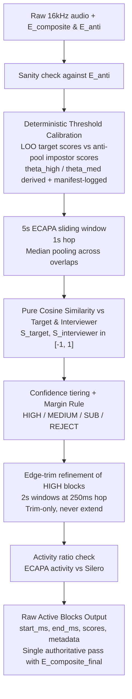

# SPOVNOB — Audio Diarization Pipeline

**Status:** System Environment ✅ Finalized | Layer 0 ✅ Finalized (Rev 2) | Layer 1 ✅ Finalized (Rev 2) | Layer 2 ✅ Finalized (Rev 2) | Layer 3 🔲 Pending

**Deployment Scenario:** 5-10 minute video clips · 5-15 videos per batch · Same room · Same microphone · Same interviewer · One continuous recording session split into multiple files — a new batch always means a new session

**Core Constraints:** Defense-grade. Air-gapped. Minimal human input after initial operator clicks. No data interpolation ever. Time in absolute milliseconds via PTS — never frame-indexed. All outputs must be fully deterministic and reproducible.

---

## System Environment & Execution Model

### Production Hardware (fixed)

| Component | Specification |
|---|---|
| GPU | NVIDIA RTX 6000 Ada Generation — 48 GB VRAM |
| CPU | 44 cores / 88 threads |
| RAM | 512 GB DDR5 |
| Storage | 2 TB local NVMe SSD |
| OS | Ubuntu (Linux) |

### CUDA Determinism Constants (architectural, non-negotiable)

Enforced at process start, before any model loads:

1. `torch.use_deterministic_algorithms(True)`
2. `torch.backends.cudnn.deterministic = True`
3. `torch.backends.cudnn.benchmark = False`
4. `os.environ["CUBLAS_WORKSPACE_CONFIG"] = ":4096:8"`

Plus: float32 precision throughout (no mixed precision), inference-only mode (no gradients, no dropout), and a 10-second verification checksum at startup to prove determinism before processing. These apply to every layer, not just Layer 2.

### Resident Model Policy

- All models are loaded **once** at batch start and held resident for the entire batch: Silero VAD (CPU), YOLOv8, InsightFace, ECAPA-TDNN, PyAnnote OVD, HuBERT. Combined footprint is well under 8 GB of the 48 GB available.
- **No `torch.cuda.empty_cache()` calls between layers. No model load/unload state machines between files.** The VRAM state machine from earlier revisions is removed as unnecessary complexity.
- **Fixed inference batch constants:** ECAPA sliding-window inference uses a fixed batch of **256 windows**; visual models use a fixed frame batch of **32**. These are architectural constants recorded in the manifest — changing a batch size can change floating-point reduction order and break bit-identical reproduction.

### Memory & Storage Policy

- The entire batch's raw 16kHz audio (~1–2 GB for 15 files) is preloaded into RAM at batch start. Sliding-window reads are zero-latency; prefetching is aggressive by default.
- No storage pressure: all audit logs, manifests, preview outputs, and the full output corpus are retained on NVMe for the entire run with no cleanup pass.

### Parallel Execution Model (Producer-Consumer with Determinism Guardrails)

Parallelism is allowed for throughput, but output must be **invariant to scheduling** — an auditor re-running on a different worker count must get byte-identical results.

- FFmpeg extraction and Silero VAD run in parallel across files on CPU threads while the GPU works.
- **Layer 1 enrollment is strictly sequential in canonical file order.** The cumulative enrollment pool is order-dependent by design; this is an architectural constraint, not an optimization target. At 5–15 files per batch the sequential cost is trivial.
- **Layer 2 scanning and Layer 3 overlap detection fan out in parallel across files.** E_composite is frozen, so files are independent.
- **Canonical Manifest Merge Rule:** workers write per-file logs; a single writer merges them sorted by `(file_index, start_ms)` — never by arrival order. The final manifest is byte-identical across re-runs regardless of scheduling.
- Optional visual-scan efficiency rule (deterministic, documented, not required at this batch size): full-rate YOLOv8/InsightFace inference only within Silero speech regions ± `vad_tol`; fixed-stride sampling during silence. Every enrollment trigger already requires VAD speech, so behavior is unchanged; the rule depends only on the input, so it remains deterministic.

### Model Vendoring Mandate (air-gap startup gate)

- All six model weight sets are pre-staged in a local model store: Silero VAD, YOLOv8, InsightFace, ECAPA-TDNN (SpeechBrain), PyAnnote OVD, HuBERT.
- At startup, the SHA-256 of **every** weight file is computed, verified against the pinned expected-hash manifest, and recorded in the session manifest.
- **Any checksum mismatch is a BLOCKING HALT before any processing. The pipeline refuses to start.**
- No network access is ever attempted: all hub-download code paths are disabled (`HF_HUB_OFFLINE=1`, `TRANSFORMERS_OFFLINE=1`); PyAnnote and SpeechBrain load exclusively from the local store.

### Session Topology Guarantee

- All files in a batch come from **one continuous recording session** — same subject, same room, same microphone, same day. Cross-session mixing never occurs within a batch; a new batch always means a new session.
- Per-batch threshold calibration is therefore per-session by construction. No session-grouping mechanism exists or is needed.
- Cross-video drift detection remains informational and non-blocking (same mic, same room — drift expected to be minimal).

---

## Full Pipeline Flow Diagram

```mermaid
flowchart TD
    INPUT["RAW INPUT BATCH<br/>5-15 video files · 5-10 min each<br/>.mp4 / .mov / .mkv<br/>Same room · same mic · one continuous session"]

    INPUT --> FFMPEG

    subgraph L0["LAYER 0 — FOUNDATIONAL EXTRACTION"]
        direction TB
        FFMPEG["FFmpeg Audio Strip<br/>16kHz Mono WAV per file<br/>PTS sync — NOT frame counting<br/>VFR Clock Desync protection"]
        FFMPEG --> PREGATE
        PREGATE["Silero Neural VAD<br/>CPU-resident · ~1MB · Zero VRAM<br/>Non-destructive masking logic<br/>Speech segment map to manifest"]
    end

    PREGATE --> L1_ENTRY

    subgraph L1["LAYER 1 — VISUAL-ANCHORED ENROLLMENT"]
        direction TB

        L1_ENTRY["Video Frame Stream<br/>Parallel to audio processing<br/>Applied to Video 1 first"]
        L1_ENTRY --> YOLO

        YOLO["YOLOv8<br/>Person detection every frame<br/>Bounding boxes for all persons<br/>Empty frames skipped"]

        YOLO --> OP_CLICK1
        OP_CLICK1["CLICK 1 — Speaking Click<br/>Operator selects target while speaking<br/>System validates: overlap check + min 2s<br/>Re-click prompted if validation fails"]

        OP_CLICK1 --> IFACE
        IFACE["InsightFace<br/>Biometric lock → F_target<br/>Min confidence threshold enforced<br/>Low-confidence frames = not detected"]

        IFACE --> ESEED
        OP_CLICK1 --> ESEED
        ESEED["E_seed — Seed Vector<br/>ECAPA-TDNN d-vector<br/>3-8 sec · 100% verified<br/>SEED ONLY — not production-ready"]

        YOLO --> OP_CLICK2
        OP_CLICK2["CLICK 2 — Anti-Profile Click<br/>Optional · Track C<br/>Operator clicks interviewer if on-camera<br/>Validated: clicked face must differ from F_target"]

        OP_CLICK2 --> EANTI_C["E_anti from Track C<br/>ECAPA-TDNN d-vector<br/>Explicit click · High confidence<br/>Priority over Track B auto-collection"]

        subgraph PHASE3["PHASE 3 — Dual-Track Visual Confirmation Loop<br/>Scans FULL VIDEO (5-10 min)"]
            direction TB
            TRACK_A["TRACK A — Target Enrollment<br/>Face confirmed + lips moving<br/>PTS timestamp → audio window"]
            TRACK_B["TRACK B — Anti-Profile Auto<br/>Face confirmed + lips CLOSED<br/>Audio energy present · single speaker<br/>M-Trap Guard: reject if sim to E_seed is high"]
        end

        ESEED --> PHASE3
        EANTI_C --> PHASE3
        TRACK_B --> EANTI_POOL["E_anti Pool<br/>Track B ECAPA-TDNN d-vectors<br/>Mean-pooled into E_anti"]
        EANTI_POOL --> TRIPLE_GATE

        PHASE3 --> TRIPLE_GATE
        TRIPLE_GATE{"Triple Validation Gate<br/>Every Track A candidate window"}

        TRIPLE_GATE --> |"Gate A FAIL<br/>Overlap detected"|DISCARD_A["Discard · Logged"]
        TRIPLE_GATE --> |"Gate B FAIL<br/>Low sim to E_seed"|DISCARD_B["Discard · Logged"]
        TRIPLE_GATE --> |"Gate C FAIL<br/>High sim to E_anti<br/>OR margin too small"|DISCARD_C["Discard · Logged"]
        TRIPLE_GATE --> |"All gates PASS"|ACCEPTED["Accepted Enrollment Segment<br/>ECAPA-TDNN d-vector extracted<br/>Added to cumulative pool"]

        ACCEPTED --> QUALITY_CHECK
        QUALITY_CHECK{"Enrollment Quality<br/>After each video"}

        QUALITY_CHECK --> |"STRONG<br/>45s+ · low variance"|STRONG_PATH["E_composite PROMOTED<br/>PENDING files processed in authoritative final pass"]
        QUALITY_CHECK --> |"MARGINAL<br/>20-45s or high variance"|MARGINAL_PATH["Working draft<br/>Second pass attempted<br/>Carry to next video"]
        QUALITY_CHECK --> |"INSUFFICIENT<br/>Under 20s"|INSUFF_PATH["Layer 2 and 3 DEFERRED<br/>File flagged PENDING<br/>Raw audio + Silero map retained"]
        QUALITY_CHECK --> |"All videos done<br/>Still insufficient"|CRITICAL_FAIL["CRITICAL ENROLLMENT FAILURE<br/>Terminal halt · Operator required"]

        STRONG_PATH --> COMPOSITE
        MARGINAL_PATH --> COMPOSITE
        INSUFF_PATH --> NEXT_VIDEO["Next Video<br/>Anchors propagate: F_target · E_seed · E_anti · pool"]
        NEXT_VIDEO --> PHASE3

        COMPOSITE["E_composite — Enrollment Profile<br/>Mean-pooled ECAPA-TDNN d-vector<br/>Single cumulative pool · all videos<br/>FROZEN after Layer 1 complete"]

        COMPOSITE --> VARIANCE_GATE
        VARIANCE_GATE{"Quality Variance Gate<br/>Pairwise cosine similarity"}
        VARIANCE_GATE --> |"Low variance"|PASS_L2["E_composite PASSED<br/>Ready for Layer 2"]
        VARIANCE_GATE --> |"High variance"|FLAG_REVIEW["Operator Review<br/>High-variance windows flagged<br/>Human decides · do not auto-discard"]
        FLAG_REVIEW --> PASS_L2
    end

    PASS_L2 --> L2_ENTRY

    subgraph L2["LAYER 2 — PURE ECAPA SLIDING WINDOW SCANNING"]
        direction TB

        L2_ENTRY["Layer 2 Entry<br/>Receives: frozen E_composite, E_anti + raw 16kHz audio<br/>Operates directly on raw audio"]
        L2_ENTRY --> SANITY

        SANITY{"E_composite Sanity Check<br/>sim(E_composite, E_anti)"}
        SANITY --> |"Below warning threshold"|CALIB
        SANITY --> |"Above warning threshold"|L2_WARN["Non-blocking warning logged<br/>Enrollment may be contaminated<br/>Operator alerted · proceeds"]
        SANITY --> |"Critically high"|L2_HALT["BLOCKING HALT<br/>Compromised enrollment<br/>Re-run Layer 1 required"]
        L2_WARN --> CALIB

        CALIB["Deterministic Threshold Calibration<br/>LOO enrollment scores vs anti-pool impostor scores<br/>theta_high / theta_med derived · manifest-logged"]
        CALIB --> TSVAD_PROC

        TSVAD_PROC["ECAPA-TDNN Sliding Window Processor<br/>Pure Cosine Similarity Scoring<br/>5s window · 1s hop · Median pooling<br/>Fully deterministic · CUDA det. mode enforced"]
        TSVAD_PROC --> TIER

        TIER{"Confidence Tier Gate<br/>If E_anti exists: S_target > theta_high AND (S_target - S_interviewer) > margin<br/>If E_anti missing: S_target > theta_high (flagged)"}

        TIER --> |"HIGH confidence"|EDGE_TRIM["Edge-Trim Refinement<br/>2s windows · 250ms hop<br/>Trim-only · never extend"]
        EDGE_TRIM --> RAW_OUT["Output Raw Active Blocks<br/>250ms-resolution edges<br/>Passed to Layer 3 for smoothing"]
        TIER --> |"MEDIUM theta_med to theta_high"|MED_LOG["Sub-threshold Evidence Log<br/>NEVER auto-fed to HuBERT<br/>Human review only<br/>Future Option B: may go to Layer 3<br/>if human review unavailable"]
        TIER --> |"0.20 to theta_med"|SUBLOG["Sub-threshold Evidence Log<br/>Investigative evidence only"]
        TIER --> |"Below 0.20"|REJ["Rejected<br/>Timestamp + score logged"]

        RAW_OUT --> RATIO_CHECK
        RATIO_CHECK{"Activity Ratio Check<br/>ECAPA activity vs Silero total speech"}
        RATIO_CHECK --> |"Above 0.25<br/>Normal"|L2_OUT
        RATIO_CHECK --> |"0.10 to 0.25<br/>Low"|L2_ADVISORY["Advisory flag logged<br/>proceeds"]
        RATIO_CHECK --> |"Below 0.10<br/>Near-zero"|L2_ALERT["Alert: zero activity<br/>Silence or model failure<br/>Manual review required · proceeds"]

        L2_ADVISORY --> L2_OUT
        L2_ALERT --> L2_OUT

        L2_OUT["Active Windows Output<br/>start_ms · end_ms · duration_ms<br/>confidence tier · mean/min confidence<br/>enrollment_ref SHA-256<br/>thresholds used · operator_modified flag<br/>PTS-based — never frame-indexed"]

        L2_OUT --> RETRO_PASS
        RETRO_PASS["Authoritative Final Pass<br/>Single Layer 2 pass with frozen E_composite_final<br/>Runs after Layer 1 completes across all videos<br/>Optional preview pass (default OFF) always superseded<br/>SHA-256 output hash computed"]
    end

    RETRO_PASS --> L3_ENTRY

    subgraph L3["LAYER 3 — CONTAMINATION FLAGGING (Overlap Detection)"]
        direction TB
        L3_ENTRY["Receives: RAW HIGH confidence frames<br/>Evaluate frames and gaps for overlap"]
        L3_ENTRY --> OVERLAP_DET
        OVERLAP_DET["Explicit Overlap Detector<br/>E-SHARC inspired framework<br/>Is anyone else speaking simultaneously?"]
        OVERLAP_DET --> OV_GATE{"Simultaneous speech<br/>in window or gap?"}
        OV_GATE --> |"NO — target alone"|CLEAN_RAW["CLEAN Raw Frames"]
        OV_GATE --> |"YES — overlap"|CONTAM["CONTAMINATED Window<br/>Logged as NaN<br/>Timestamp preserved<br/>Do NOT feed to HuBERT"]
        
        CLEAN_RAW --> L3_SMOOTH["Temporal Smoothing<br/>Merge gaps under 400ms<br/>Only across clean gaps"]
        L3_SMOOTH --> CLEAN["CLEAN Target Segments<br/>Safe for HuBERT"]
    end

    CLEAN --> HUBERT
    CONTAM --> AUDIT_LOG

    HUBERT["HuBERT<br/>Paralinguistic Feature Extraction<br/>Vocal stress · Hesitation · Cognitive load<br/>ONLY clean target-isolated audio<br/>Zero contamination · Scientifically valid"]

    AUDIT_LOG["Audit Log<br/>NaN windows · Enrollment quality history<br/>Discarded candidates · Variance flags<br/>Sub-threshold evidence · Operator decisions<br/>Video gap entries · Drift notices<br/>Operator threshold modifications<br/>SHA-256 output hash<br/>Complete forensic chain of custody"]
```



---

## Layer 0 — Finalized Architecture Notes

### Purpose
Convert raw video into PTS-true 16kHz mono audio plus a Silero speech segment map. No identity decisions made here. Pure signal processing. Raw audio and segment maps are retained until the entire batch is processed and the authoritative final pass is confirmed complete.

### Input Scenario
- 5-10 minute video clips, 5-15 files per batch
- Same room, same microphone, same interviewer, same continuous session (same day) — split at the file system level; a new batch always means a new session
- Treated architecturally as one continuous recording with file-boundary seams

### Components

**Global PTS Clock Initialization**
- Every video file starts with its own PTS clock at 0. To maintain a unified session timeline, the system computes a `file_offset_ms` for each file at batch initialization (the cumulative audio duration of preceding files).
- All absolute timestamps across all layers operate on `global_ms = file_offset_ms + local_pts_ms`. Output logs carry both.

**FFmpeg Audio Strip**
- Strips audio from each video container to 16kHz mono WAV
- Timestamp synchronization via PTS (Presentation Timestamps) — never frame counting
- This is the foundational protection against VFR Clock Desync in all downstream layers

**Pre-Gate: Silero Neural VAD (Non-Destructive Masking)**
- CPU-resident. ~1MB model. Zero VRAM consumption.
- Neural classifier for speech vs. non-speech at frame level.
- **Critical Fix:** Audio is NOT hard-zeroed. Hard-zeroing creates artificial amplitude cliffs that corrupt downstream acoustic processing. Silero never modifies the audio — it only produces a segment map.
- Silero's output is saved as a list of `(speech_start_ms, speech_end_ms)` segment pairs. These segments gate downstream ECAPA window scoring (Layer 2 Silero skip rule) and feed the activity ratio check.

**WavLM — Removed from Layer 0 (Revision 2)**
- Earlier revisions computed WavLM Base+/Large frame embeddings here (10s chunks, 1s overlap-add stitching, HDF5 storage, ~7-10 GB per batch) to feed a since-rejected cross-attention scorer in Layer 2.
- Under the Pure ECAPA architecture, no layer consumes those embeddings: Layer 1 ECAPA enrollment, Layer 2 sliding-window scanning, Layer 3 overlap detection, and HuBERT all operate on raw audio. The pipeline's most expensive computation had zero consumers.
- WavLM, the HDF5 store, the overlap-add stitching, and the chunk-boundary machinery are therefore removed entirely. Layer 0 is reduced to FFmpeg PTS-true extraction plus the Silero segment map.
- See the Layer 2 Decision Record for the full audit-grade rationale, including why reusing WavLM via a pre-trained Speaker Verification head (Option B) was rejected.

### Key Constraints
- No audio interpolation or synthetic generation
- VFR drift cannot affect this layer — PTS is the only clock
- No internet or external API calls — fully local inference

---

## Layer 1 — Finalized Architecture Notes

### Purpose
Extract a production-grade Target Enrollment Profile (E_composite) as the acoustic fingerprint for Layer 2 ECAPA. EEND eliminated entirely. All identity anchoring is deterministic and visual. E_composite is frozen after Layer 1 completes and never modified in any later layer.

### ECAPA-TDNN (Speaker Encoder) & The Zero-Training Mandate
- **No Training/Fine-tuning:** This pipeline does **not** train or fine-tune models on the target's data. All models (InsightFace, YOLOv8, ECAPA-TDNN) are run frozen, purely in inference mode.
- **Role of ECAPA-TDNN:** ECAPA-TDNN consumes the raw 16kHz audio segment directly (it computes its own filterbank features internally) and distills it into a single 192- or 256-dimensional identity vector (**d-vector**) representing *who* is speaking.
- **Enrollment Arithmetic:** `E_seed`, `E_anti`, and `E_composite` are all ECAPA-TDNN d-vectors. Enrollment is simply the duration-weighted mean-pooling of these d-vectors from visually verified audio windows (`sum(d_i * duration_i) / sum(duration_i)`), so a residual 2s window cannot mathematically overpower a 10s window. It is highly deterministic arithmetic, not backpropagation or model weight updates.

### `E_seed` capture strategy for offline review

This pipeline is not live. The operator may watch the video first, identify the longest clean speaking stretch for `F_target`, and only then trigger the first Speaking Click. The goal is to build the strongest possible first `E_seed` from a visibly verified, uninterrupted target-speaking segment rather than the first short utterance that happens to appear.

- Preferred capture behavior:
    - Review the full video before clicking.
    - Choose the longest target-speaking segment that is visually clean and not overlapped.
    - Prefer a continuous seed window that is substantially longer than 5 seconds when available.
    - If the target produces a 20–30 second monologue, capture the whole monologue as the seed window.
    - If speech continues longer than 30 seconds and remains clean, the pipeline may keep the window open until the stop rule is satisfied.

- Seed quality intent:
    - The first `E_seed` should be stronger than a minimal seed because it directly improves the stability of all later enrollment gates.
    - A longer clean seed improves ECAPA-d-vector robustness against momentary prosody changes, noise, and small facial-motion artifacts.
    - This is especially important because `E_seed` becomes the reference for Gate B and influences the M-Trap behavior for `E_anti`.

- Updated working length guidance:
    - Minimum acceptable seed length: 3 s.
    - Practical preferred seed length: 5 s or more.
    - Strong seed target range: 20–30 s when a clean continuous speaking stretch exists.
    - No hard maximum unless the operator or validation rules terminate the window.

### `E_window` — definition, capture, and parameters

`E_window` is the atomic enrollment candidate: a contiguous, PTS-aligned audio segment extracted when `F_target` is visually observed speaking. `E_window` is *not* a random chunk; it is a deterministic, visually-anchored segment that may be any length (no hard upper cap) and is subject to minimum-duration requirements.

- Start / Stop policy (visual + audio):
    - **Start trigger (`T_start`)**: when `F_target` is present and the smoothed Mouth Aspect Ratio (MAR) crosses the `MAR_on` threshold *and* Silero VAD indicates speech within ±50 ms, set `T_start` = PTS (ms).
    - **Stop trigger (`T_stop`)**: when MAR falls below `MAR_off`, start a plosive buffer timer (default 500 ms).
        - If the target's MAR rises above `MAR_on` before the timer elapses, continue.
        - **Early Stop Rule:** If the interviewer's face is visible and their MAR rises above `MAR_on` *during* the target's plosive buffer, immediately set `T_stop` to the current PTS and discard the buffer to prevent capturing the interviewer's interjection.
        - If the timer expires cleanly, set `T_stop` = timer expiry PTS.
    - **No arbitrary truncation:** if the subject speaks continuously for 12 seconds, the system captures the full 12-second `E_window`.

- Post-capture checks:
    - **Minimum duration:** discard `E_window` for enrollment if duration < `min_enroll_len` (default 2.0 s). For operator-verified `E_seed`, enforce 3–8 s as the seed window.
    - **Single-Pass ECAPA Encoding:** Each `E_window` is encoded in one ECAPA forward pass regardless of length — on 48 GB VRAM even a 60-second segment is trivial, so the earlier 10s sub-chunking rule (a VRAM workaround) is removed as dead weight. Sanity cap only: in the rare case an `E_window` exceeds 60 seconds, split at 60s boundaries (2s overlap) and duration-weight-pool the resulting d-vectors.
    - **Gate A (Visual Contamination Check):** Require Silero VAD to confirm speech, AND if the interviewer is visible, require their lips to be closed (`MAR < MAR_off`) for `> 0.80` fraction of the window. This replaces uncomputable energy-ratio logic.

- MAR Definitions & Suggested parameters (tunable via manifest):
    - **MAR Normalization:** MAR is defined as the vertical inner-lip distance divided by the outer mouth width. **Explicit InsightFace 2d106det Indices:** Upper inner lip (52, 53, 54), Lower inner lip (61, 62, 63), Outer width (distance between 52 and 61). This ensures face-scale invariance.
    - **Head Pose Yaw Filter:** If head yaw > 35 degrees, lips project into a foreshortened geometry, artificially crashing MAR. When yaw > 35°, suspend MAR checking entirely. Do not trigger the plosive buffer. Wait for the head to return.
    - `MAR_on` / `MAR_off`: use hysteresis; suggested starting values `MAR_on=0.55`, `MAR_off=0.40` (normalized MAR). Validate per camera/angle.
    - MAR smoothing: 5-frame EMA (causal). *Critical:* Pre-seed the EMA buffer with frame 0's MAR value to prevent 4-frame warmup artifacts at the start of a video.
    - Face Re-ID: `face_reid_threshold = 0.40` (ArcFace cosine sim). Maintains target lock.
    - Plosive buffer: `plosive_ms = 500` ms (tunable 300–700ms).
    - VAD alignment tolerance: `vad_tol = 50` ms.
    - `min_enroll_len = 2.0` s (seed windows: 3–8 s required).

- `E_window` output (persisted):
    - `source_file`, `track_id`, `T_start`, `T_stop`, `duration_ms`, `wav_path` (raw segment), `mar_trace`, `silero_trace`, `flags` (passed_gates / failed_reason).

### `threshold_target`, `E_anti` capture, and how `E_anti` is used

`threshold_target` is the similarity threshold used in Gate B (enrollment inclusion relative to the verified seed `E_seed`). It is a configurable parameter recorded in the session manifest.

### Enrollment parameter table

These are the current working defaults for `E_window` capture, `E_anti` capture, and the acceptance gates. Every value is tunable only through the append-only manifest unless marked as architectural.

| Parameter | Default | Scope | Purpose | Notes |
|---|---:|---|---|---|
| `silero_threshold` | 0.50 | Layer 0 | VAD binary speech decision | Affects sensitivity to quiet speech vs noise |
| `face_reid_threshold` | 0.40 | `E_window` tracking | ArcFace cosine sim to keep target lock | Warn if running mean drops below 0.50 |
| `MAR_on` | 0.55 | `E_window` capture | Start speaking window when lips clearly open | Computed via InsightFace inner lip normalization |
| `MAR_off` | 0.40 | `E_window` capture | Begin stop timer when lips close | Head yaw > 35° suspends MAR entirely |
| `plosive_ms` | 500 ms | `E_window` capture | Keep window open through short lip closures | Early-stop if interviewer MAR > MAR_on |
| `vad_tol` | 50 ms | `E_window` capture | Align audio speech evidence with lip-motion evidence | Small tolerance for VAD / PTS mismatch |
| `min_enroll_len` | 2.0 s | `E_window` capture | Minimum duration for enrollment candidate | Below this, discard for enrollment and log only |
| `seed_len_target` | 5–30+ s preferred | `E_seed` capture | Recommended seed clip length | Minimum 3 s acceptable. Encoded in a single ECAPA pass (60s sanity cap) |
| `int_lips_closed_frac`| 0.80 | `E_window` / Gate A | Ensure interviewer is visually silent | Replaces uncomputable energy ratio logic |
| `threshold_target` | 0.70 | Gate B | Require similarity to `E_seed` | Raw cosine value — validate against real seed-vs-window score distributions in the first benchmark; may need lowering to 0.55-0.65 |
| `threshold_anti` | 0.50 | Gate C | Require low similarity to `E_anti` | Lower = stricter anti-profile rejection |
| `margin_minimum` | 0.15 | Gate C | Enforce separation between target and anti-profile similarity | Reject ambiguous windows |
| `mtrap_sim_max` | 0.60 | `E_anti` Track B | Discard anti candidates too similar to `E_seed` | Silently discard and log |
| `anti_contam_warning` | 0.45 | `E_anti` sanity check | Warn if `E_composite` may be contaminated | Lowered from 0.60 for extreme sensitivity |
| `anti_contam_halt` | 0.60 | `E_anti` sanity check | Halt if contamination is critically high | Blocking; re-run Layer 1 |
| `pool_var_warning` | 0.05 | `E_composite` pool | Warn if intra-pool variance increases across videos | Detects degrading enrollment quality |

- If `E_anti` is missing, keep the pipeline running and skip Gate C rather than failing closed.
- If the interviewer is off-camera or silent, Track C may be absent and Track B may produce no anti vectors; this is allowed and must not break the batch.

- Recommended defaults (tunable and manifest-logged):
    - `threshold_target` (Gate B): default **0.70** — requires reasonably high similarity to `E_seed` for inclusion.
    - `threshold_anti` (Gate C): default **0.50** — window must have *lower* similarity to `E_anti` than this value to pass.
    - `margin_minimum`: default **0.15** — require `sim(window,E_seed) - sim(window,E_anti) >= margin_minimum` to avoid ambiguous windows.

- `E_anti` capture methods (dual-track):
    - **Track C — Operator Anti-Profile Click (manual):** Operator clicks an on-camera interviewer frame where lips are confirmed closed. That exact PTS window is extracted and converted to an ECAPA d-vector. This `E_anti_C` takes priority over auto-collected anti vectors.
    - **Track B — Automatic Anti-Profile Collection (auto):** Continuously monitor detected faces. When a face (not matching `F_target`) is present with MAR below `MAR_off` (lips closed) and Silero VAD indicates audio-energy at the same PTS, extract a `2000ms` window around that PTS and compute an ECAPA d-vector candidate. Candidates are accepted only if they pass the M-Trap guard (see below). Accepted candidates are appended to the `E_anti_pool`.

- `E_anti` pool and aggregation:
    - Keep an append-only `E_anti_pool` of ECAPA d-vectors from Track B and the prioritized Track C vectors.
    - Compute `E_anti` as the mean-pooled vector of the pool for use in Gate C and sanity checks. Also persist `E_anti_pool_sha256` in the manifest for audit.
    - **Intra-Pool Variance Check:** After each video's contribution is pooled, if the pairwise cosine variance of all d-vectors in the pool increases by more than `pool_var_warning` (default 0.05), log a warning that later enrollments are degrading the profile quality.

- M-Trap Guard (protects against accidental self-enrollment into `E_anti`):
    - For any candidate anti vector `v`, compute `sim(v, E_seed)`. If `sim > mtrap_sim_max` (suggested 0.60) then discard silently (candidate likely the target making a lips-closed phoneme) and log the discard.

- When `E_anti` is used
    - **Triple Validation Gate (during Phase 3)**: For each `E_window` candidate:
        - Gate A: Silero confirms speech AND interviewer lips closed >80% of window.
        - Gate B: `cosine_sim(window, E_seed) >= threshold_target`.
        - Gate C: `cosine_sim(window, E_anti) <= threshold_anti` AND `(sim(window,E_seed) - sim(window,E_anti)) >= margin_minimum`.
        - Only windows passing all three gates are accepted into the enrollment pool.
    - **Sanity checks:** compute `sim(E_composite, E_anti)` after pooling; if above `anti_contam_warning` (0.45) emit non-blocking warning; if above `anti_contam_halt` (0.60) trigger blocking halt and operator re-run of Layer 1.

- Missing `E_anti` / interviewer not visible / no interviewer audio
    - If no `E_anti` exists (no Track C click and `E_anti_pool` empty): do *not* apply Gate C. Instead, log `E_anti_missing=true` in the candidate record and in the manifest. Continue processing but mark enrollment quality as `NO_ANTI_PROFILE` and escalate the variance gate thresholds (i.e., require stronger Gate B similarity or more cumulative seconds to promote to STRONG) — this avoids pipeline breaks while preserving audit warnings.
    - If interviewer visible but interviewer audio missing (no VAD energy): Track B may still produce `E_anti` only if audio-energy is present; otherwise rely on operator Track C or proceed without `E_anti`.

### Persistence, audit, and manifest rules for `E_anti` and `E_window`

- Every time an `E_window`, `E_seed`, or `E_anti` vector is created or modified (pool appended), append an immutable entry to the session manifest with: timestamp_utc, operation, source_file, track_id, PTS range, ECAPA_sha256, vector_dim, operator_id (if applicable), and stated_reason (if operator-modified). This creates the chain-of-custody for enrollment artifacts.
- Store the raw WAV segment and its absolute PTS range for reproducibility and later re-run.

### Pseudocode snippets

E_window capture loop (frame-driven):

```
if face==F_target:
        mar_s = EMA(mar)
        if not active and mar_s > MAR_on and Silero.vad_near(pts, vad_tol):
                T_start = pts; active=True
        if active and mar_s < MAR_off:
                start plosive_timer(plosive_ms)
        if plosive_timer running and mar_s > MAR_on:
                cancel plosive_timer
        if plosive_timer expired:
                T_stop = current_pts; finalize E_window; active=False
                if duration < min_enroll_len: discard for enrollment else persist
```

E_anti auto-collection (Track B):

```
if face != F_target and face.present and mar_s < MAR_off and Silero.vad_energy_high(pts):
        candidate = extract_window_around(pts, context=2000ms)
        v = ecapa_encode(candidate)
        if sim(v,E_seed) > mtrap_sim_max: discard silently
        else append_to_E_anti_pool(v)
```


### Recommended ECAPA-TDNN Variant

- **Choice:** ECAPA-TDNN (C=1024) — recommended for SPOVNOB given available compute resources.
- **Rationale:** The C=1024 variant shows consistent absolute EER improvements (~0.12–0.14) over C=512 on standard benchmarks at the cost of ~2.4× parameters (14.7M vs 6.2M). With abundant VRAM and CPU (48GB VRAM, 44 cores) this accuracy gain improves forensic sensitivity where small verification gains can be meaningful.
- **Operational notes:** Expect larger model files, higher VRAM usage and longer per-window inference time. Keep C=512 as a documented fallback for constrained or ad-hoc checks, but use C=1024 as the production default for enrollment and ECAPA-conditioned extraction.
- **Validation:** Run a small benchmark on representative enrollment (3–8s) and evaluation clips to measure EER, inference latency, and VRAM. Record the results and the chosen parameterization in the session manifest.

### Why EEND Was Eliminated
- **Hazard A — Label Permutation:** EEND processes in chunks with randomly swapped speaker labels between chunks. Stitching a coherent multi-file timeline is mathematically unstable and forensically indefensible.
- **Hazard B — VFR Tensor Desync:** AV-fusion EEND-M2F requires perfectly paired audio/video tensors. VFR footage cannot be paired without interpolation. Interpolation violates the no-synthetic-data mandate.

### Video Scan Window
For 5-10 minute videos: the Visual Confirmation Loop scans the **entire video**. VFR drift at 10 minutes is negligible for enrollment purposes. Scanning the full video maximizes verified enrollment audio per file.

### Operator Input — Minimal and Validated

| Click | Who | When | Status |
|---|---|---|---|
| Click 1 — Speaking Click | Target | Any moment target is observed speaking | Mandatory · Video 1 only · operator may pre-review the clip and choose the longest clean speaking stretch |
| Click 2 — Anti-Profile Click | Interviewer | Interviewer visible, target lips confirmed closed | Optional · Track C · If interviewer never on-camera, omit |

After Video 1: all anchors (`F_target`, `E_seed`, `E_anti`, cumulative pool) propagate automatically. No further clicks unless a validation guard fails.

### Anti-Profile Dual-Track Strategy
**Track C (Manual):** Operator Anti-Profile Click when interviewer is on-camera. High confidence. Takes priority. Validated: clicked face must not match F_target.

**Track B (Automatic):** Always running. Conditions: InsightFace confirms target present + LAD confirms lips CLOSED + audio energy present + single-speaker dominant. M-Trap Guard: cross-check every candidate against E_seed — high similarity means target was making a lips-closed phoneme, discard.

Both tracks contribute to the E_anti pool. Track C takes priority. If interviewer is never on-camera, Track B builds E_anti entirely automatically.

### Phase-by-Phase Summary

| Phase | Action | Output |
|---|---|---|
| Phase 1 | Speaking Click + immediate validation | E_seed (3-8 sec, 100% verified seed) |
| Phase 2 | Anti-Profile Click (optional) + Track B auto | E_anti (dual-track anti-profile) |
| Phase 3 | Full-video Dual-Track Visual Confirmation Loop | Pool of triple-validated enrollment windows |
| Phase 4 | Cumulative Pool Construction | E_composite (recalculated after each video) |
| Phase 5 | Quality Variance Gate | Pass / Flag for operator review |

### The Triple Validation Gate
Every Track A candidate window must simultaneously pass:
- **Gate A:** Single-speaker energy dominance — no overlap
- **Gate B:** `cosine_sim(window, E_seed) > threshold_target`
- **Gate C:** `cosine_sim(window, E_anti) < threshold_anti` AND `sim(window, E_seed) - sim(window, E_anti) > margin_minimum`

Windows where the target/interviewer similarity margin is critically small are discarded as ambiguous even if they individually pass Gates B and C.

### Progressive Enrollment Quality States

| State | Trigger | System Action |
|---|---|---|
| STRONG | ≥ 45s verified · low variance | E_composite promoted. PENDING files are processed in the authoritative final pass. |
| MARGINAL | 20-45s OR high variance | Second pass of same video with improved anchor. Carry to next video. Log warning. |
| INSUFFICIENT | < 20s | Defer Layer 2+3. Flag file PENDING. Retain raw audio + Silero map. Carry partial E_composite. |
| CRITICAL FAILURE | All videos done · still INSUFFICIENT | Terminal halt. Operator must intervene. Analysis not possible. |

### PENDING File Handling (Authoritative Pass)
When E_composite promotes to a higher state, PENDING files require no special handling: under the single-authoritative-pass model, every file — PENDING or not — receives Layer 2 and Layer 3 exactly once, after Layer 1 has completed across all videos, using the frozen E_composite_final on raw audio. ECAPA sliding-window inference is lightweight and requires no cached embeddings. No behavioral data permanently lost.

### Cumulative Pool
Single growing pool across all videos. Every triple-validated window from every video added to this pool. E_composite recalculated after each video's contribution (running mean-pool). ECAPA for Video 2 already uses a better E_composite than Video 1. No session-level intermediate vectors.

### The 9 Guardrails

| # | Guard | Trigger | Response |
|---|---|---|---|
| 1 | Speaking Click overlap check | Simultaneous speech at click timestamp | Alert: re-click required |
| 2 | Speaking Click min duration | Seed clip < 2 seconds | Alert: re-click required |
| 3 | Anti-Profile identity check | Clicked face matches F_target | Alert: wrong person clicked |
| 4 | M-Trap guard on Track B | E_anti candidate has high sim to E_seed | Silently discard |
| 5 | InsightFace confidence threshold | Detection confidence below minimum | Frame treated as not detected |
| 6 | Low detection quality warning | Running average confidence below floor | Alert: camera angle may be poor |
| 7 | Separation margin check | sim(E_seed) - sim(E_anti) below minimum | Discard as ambiguous |
| 8 | Acoustic similarity warning | sim(E_seed, E_anti) above critical threshold | Alert: voices acoustically similar |
| 9 | Critical enrollment failure | All videos done, still INSUFFICIENT | Terminal halt |

### Cross-File Behavior
- Anchor propagation: F_target, E_seed, E_anti, cumulative pool carry forward Video 1 → all subsequent videos automatically
- No threshold recalibration needed: same room, same mic, same session — acoustic space is identical across all files
- Video gap logging: audit log records a gap entry at the start of each video after Video 1

---

## Layer 2 — Finalized Architecture Notes

### Purpose
Scan the raw 16kHz audio using the frozen E_composite to produce millisecond-stamped blocks of confirmed target activity. Layer 2 operates **directly on raw audio** with a pure ECAPA-TDNN sliding window classifier. WavLM does not exist anywhere in this layer — or, as of this revision, anywhere in the pipeline (see Decision Record below). All output is fully deterministic and reproducible.

### Decision Record — Why Pure ECAPA (Option A) Was Retained and WavLM-SV Reuse (Option B) Was Rejected

This record exists so the architectural choice is auditable without reconstructing the design history.

**Option B proposed:** reuse the WavLM-Large frame embeddings computed in Layer 0 by passing them through a pre-trained Speaker Verification head, eliminating the second full-video inference pass and unifying enrollment and tracking in one embedding space.

**Option B is rejected on four grounds:**

1. **The cached features are the wrong features.** Every published WavLM-SV system (SUPERB protocol, microsoft/UniSpeech SV release, `wavlm-base-plus-sv`) consumes a **learnable weighted sum across all transformer layer outputs** (25 layers for Large), because speaker identity information concentrates in the *lower* transformer layers while the final layers encode phonetic content. Layer 0's HDF5 stores a single 1024-dim vector per frame (final-layer output). A pre-trained SV head fed final-layer-only features is operating outside its training distribution — the same class of geometric-incompatibility error that killed the original cross-attention scorer, one level subtler. Fixing this requires caching all 25 layers (~25× storage: 175–250 GB per batch) or folding one specific head's frozen layer weights into Layer 0 (making the cache head-specific and non-general).

2. **The turnkey checkpoint's backbone is not our backbone.** `microsoft/wavlm-base-plus-sv` is WavLM Base+ **fine-tuned end-to-end** (X-vector head, AM-Softmax, VoxCeleb1). Its backbone weights have diverged from vanilla `wavlm-base-plus`. Embeddings computed by the vanilla backbone in Layer 0 cannot be fed into that head. Using the checkpoint correctly means running its full backbone on raw audio — i.e., a second full-video inference pass, the exact cost Option B was meant to eliminate, with a heavier model than ECAPA.

3. **The accuracy delta is marginal at this operating point.** Official UniSpeech SV results (VoxCeleb1-O EER): standalone ECAPA-TDNN 1.08% · WavLM-Large frozen backbone + ECAPA head 0.75% · WavLM-Large jointly fine-tuned 0.43%. These gaps are measured on cross-session, cross-channel, 1,251-speaker open-set trials. SPOVNOB's discrimination task is two known speakers, same room, same microphone, same session, with ≥45s of verified enrollment and a dual-target margin gate. Both systems saturate at this operating point. The headline SUPERB advantage that motivated Option B belongs to the jointly fine-tuned + large-margin + score-calibrated configuration, which does not exist as a turnkey artifact.

4. **Forensic defensibility favors the simple, widely validated model.** SpeechBrain ECAPA-TDNN is the most independently replicated open speaker encoder in existence. A research-repo WavLM-SV head adds a custom integration surface that an external auditor cannot validate against an established baseline.

**The corollary decision — WavLM is removed from Layer 0 entirely.** The original reason to compute WavLM frame embeddings was the rejected cross-attention scorer. Under Pure ECAPA, no layer consumes the HDF5 embeddings: Layer 1's ECAPA runs on raw audio, Layer 2 runs on raw audio, Layer 3's overlap detector runs on raw audio, and HuBERT consumes raw clean audio. The most expensive computation in the pipeline (and its 7–10 GB of storage, chunked overlap-add stitching, and boundary-artifact machinery) produced data with **zero consumers**. The fix for "we compute WavLM and then ignore it" is not to contort Layer 2 into consuming it — it is to stop computing it. Layer 0 is reduced to: FFmpeg PTS-true extraction + Silero VAD segment map.

### Encoder Upgrade Path (documented, not active)
If a measurable accuracy gain is ever required, the correct move is not WavLM reuse but swapping the sliding-window encoder for a stronger **raw-audio** speaker model (e.g., WeSpeaker ResNet221/ResNet293 or ERes2Net, VoxCeleb2-trained). The Layer 2 architecture is encoder-agnostic: same windows, same cosine scoring, same calibration, same gates. Switching requires only a side-by-side benchmark on representative session audio, a manifest entry recording the encoder identity and checksum, and re-validation of calibrated thresholds. No architectural redesign.

### Layer 2 in one sentence

Layer 2 takes the raw 16kHz audio, scores each sliding window using a pure ECAPA-TDNN dual-target cosine similarity feed against `E_composite` and `E_anti`, aggregates scores using median pooling, applies per-session calibrated thresholds, and emits raw active 1-second blocks for later contamination checking and smoothing in Layer 3.

### Layer 2 flow



### What Layer 2 is actually doing

Layer 2 is not a generic diarizer and it is not a retraining stage. It is a deterministic target-tracking pass. The input is the raw 16kHz audio from Layer 0. The conditioning signal is the frozen `E_composite` from Layer 1. The output is a set of PTS-stamped 1-second blocks where the model believes the target is speaking alone enough to be useful, plus a complete audit trail of the discarded blocks.

The important point is that Layer 2 never creates a new identity model. It only answers: "given the fixed enrollment profile, where in this audio does target speech appear?"

### Core inputs to Layer 2

- `E_composite`: frozen enrollment profile, duration-weighted mean-pooled from triple-validated Layer 1 windows.
- `E_anti`: frozen interviewer anti-profile.
- Enrollment pool d-vectors `{v_i}` and anti-pool d-vectors `{a_j}`: required for threshold calibration (read-only; never modified here).
- Raw Audio: unmodified 16kHz WAV extraction from Layer 0.
- Silero VAD segment map: used to skip non-speech regions and for the activity ratio check at the end of each file.

### Core outputs from Layer 2

- Raw `start_ms` and `end_ms` contiguous blocks for each accepted target window (no smoothing applied yet).
- `duration_ms` and median similarity scores.
- `confidence_tier` for each block.
- `enrollment_ref`, `calibration_ref`, and threshold metadata so the result can be traced back to the exact enrollment and calibration state.
- Edge-trim metadata (`leading_trim_ms`, `trailing_trim_ms`, fine-scale score traces) for every HIGH block run.
- Rejected or sub-threshold blocks preserved in the audit log, not thrown away silently.

### Score semantics — cosine similarity is not a probability

The quantity Layer 2 computes per window is a **raw cosine similarity in [-1, 1]**, written `S_target` and `S_interviewer`. Earlier drafts wrote these as `P(Target)` / `P(Interviewer)` with probability-style thresholds (0.85 / 0.65 / 0.30). That framing is mathematically wrong and operationally dangerous: ECAPA d-vector cosine similarities are not calibrated probabilities. Genuine same-speaker scores for short windows typically land in the 0.4–0.8 range; different-speaker same-channel scores typically land in the 0.1–0.4 range. A fixed 0.85 "HIGH" threshold would starve the HIGH tier and fire near-zero-activity alerts on perfectly good sessions.

Consequences enforced in this revision:

- All score fields, logs, and thresholds are named `S_*` (similarity), never `P(*)`.
- Tier thresholds are **calibrated per session** from the session's own frozen enrollment artifacts (procedure below), not hard-coded universal constants.
- Fallback defaults (used only when calibration inputs are insufficient, and flagged as such): `theta_high = 0.60`, `theta_med = 0.40`, evidence floor `0.20`.

### Deterministic Threshold Calibration

Calibration is pure, ordered arithmetic on frozen vectors — no sampling, no optimization, no model updates. It is bit-reproducible and runs once per batch, immediately after the Layer 2 sanity check.

1. **Genuine score distribution.** For each accepted enrollment window d-vector `v_i` in the frozen pool (N windows), compute the leave-one-out score `s_i = cosine_sim(v_i, mean_pool({v_k : k ≠ i}))`. This mirrors the test condition: a short window scored against a pooled profile.
2. **Impostor score distribution.** For each anti-pool d-vector `a_j`, compute `t_j = cosine_sim(a_j, E_composite)`.
3. **Threshold derivation (deterministic, conservative-biased):**
   - `theta_high = max( q10({s_i}), max({t_j}) + 0.05 )`, clamped to `[0.45, 0.75]`.
   - `theta_med = theta_high - 0.15`, clamped to `>= 0.30`.
   - Evidence floor: `0.20` (architectural constant, replaces the old 0.30).
   - If the genuine and impostor distributions overlap such that `theta_high` clamps at 0.75, log a `CALIBRATION_OVERLAP` warning — the voices are acoustically close and the margin gate becomes the primary discriminator.
4. **Missing `E_anti` degeneration:** with an empty anti-pool, `theta_high = max( q10({s_i}), 0.55 )`, and outputs carry `no_anti_profile=true`.
5. **Minimum data rule:** calibration requires N ≥ 10 enrollment windows. Below that, fallback defaults apply and every output block carries `calibration=FALLBACK_DEFAULTS`.
6. **Audit:** all inputs (vector SHA-256s), both sorted score lists, the derived thresholds, and any clamping events are written to the manifest as `calibration_ref` (SHA-256 of the calibration record). The operator may override derived thresholds only via the append-only manifest with a stated reason.

The dual-target margin rule is unchanged and is **not** calibrated: `S_target - S_interviewer > margin_minimum` (default 0.15), identical to Layer 1's Gate C margin.

### Step-by-step execution model

1. Layer 2 runs **once per batch**, after Layer 1 has completed across all videos. Load the frozen `E_composite_final`, `E_anti`, enrollment/anti pools, and the preloaded raw 16kHz audio.
2. Run a sanity check against `E_anti` before scoring any file.
3. Run deterministic threshold calibration; freeze `theta_high` / `theta_med` for the batch.
4. Slide a fixed 5-second window across the raw audio with a 1-second hop, in fixed inference batches of 256 windows.
5. Extract a 192-dim ECAPA d-vector for each window.
6. Compute `S_target = cosine_sim(window_dvector, E_composite)`. If `E_anti` exists, compute `S_interviewer = cosine_sim(window_dvector, E_anti)`.
7. Aggregate the multiple overlapping scores for each individual 1-second block using **Median Pooling**.
8. Evaluate the median score against the calibrated confidence tier gate. If `E_anti` exists, the dual-target margin rule is enforced. If missing, only the single target rule is enforced.
9. Refine the edges of every maximal HIGH block run with the trim-only fine-scale pass (2s windows, 250ms hop).
10. Compare total HIGH activity against total Silero speech duration.
11. Emit the raw accepted blocks and all metadata directly to Layer 3 (no temporal smoothing applied).
12. Optional preview mode (`run_preview_pass`, default OFF, manifest-logged): an early pass with the in-progress `E_composite` may be run for operator preview; its results are always flagged `superseded_by: authoritative_pass` and never feed Layer 3.

### How the sliding window works

The window is fixed at 5 seconds because the classifier needs enough context to distinguish stable target speech from brief false positives, but it still needs to move often enough to catch short utterances and shifts in speaking behavior. The hop is 1 second so the model samples the timeline densely.

Windowing is done over raw audio preloaded in RAM. ECAPA inference on an RTX 6000 Ada is trivial at this scale (≈400 windows per 7-minute file, processed in fixed batches of 256), which is why no intermediate embedding cache exists anywhere in the pipeline.

**Silero skip rule:** windows whose overlap with the Silero speech segment map is below 20% are not scored; they are logged as `SKIPPED_NONSPEECH` with their PTS range. This is a compute skip, not an audio modification — the audio itself is never touched.

### How a window gets scored (Cosine Similarity)

Each 5-second slice generates an ECAPA d-vector. This vector is evaluated against the frozen `E_composite` (and `E_anti`) via pure cosine similarity. This aligns exactly with the AAM-Softmax (ArcFace-family) metric space ECAPA is trained on — cosine is the native distance of this embedding space, not an approximation.

Because we use a 5-second window with a 1-second hop, each individual 1-second block is evaluated up to 5 times. To aggregate these overlapping evaluations into a single stable score per block, we use **Median Pooling**. This aggressively strips out sliding-window boundary artifacts and brief score excursions without artificially depressing the core signal.

**Turn-boundary dilution (known, accepted, mitigated):** a 5s window straddling a speaker change contains a mixture, and its d-vector is a blend — the score is diluted, not wrong. Median pooling per 1s block means a block deep inside a target turn is covered mostly by clean windows and scores high, while blocks at the turn edge are covered by mixed windows and naturally fall to MEDIUM or below. This is the desired conservative behavior: turn edges are exactly where interviewer bleed lives, and Layer 3's overlap detector independently screens whatever survives. The edge-trim refinement pass (below) then sharpens the surviving block boundaries to 250ms resolution.

### Edge-Trim Boundary Refinement (HIGH blocks only)

The 5s/1s coarse scan localizes target speech reliably, but its edges inherit up to ±1s of uncertainty, and that uncertainty lives exactly where interviewer bleed does. With resident models and free GPU headroom, Layer 2 refines every HIGH block edge with a fine-scale pass:

- For each **maximal run of contiguous HIGH 1-second blocks**, examine the leading and trailing boundary.
- Score 2-second windows at 250ms hop across `[edge - 2000ms, edge + 2000ms]` (clamped to file bounds), using the same encoder, the same frozen profiles, and the same calibrated `theta_high` plus margin rule.
- Trim the block edge **inward** to the outermost 250ms position whose fine-scale score still satisfies the HIGH criteria.
- **Trim-only invariant: refinement may shrink a block, never extend it.** Audio outside the coarse HIGH region is never promoted by this step, so the refinement can only make output more conservative — forensically safe by construction.
- If the fine scan shows an entire edge 1-second block failing the HIGH criteria, that block is demoted to MEDIUM (sub-threshold evidence log) and the demotion is logged.
- All trims are logged per boundary: `leading_trim_ms`, `trailing_trim_ms`, and the fine-scale score trace.
- Determinism: fixed window/hop constants (2s / 250ms, architectural), sequential boundary evaluation order, same fixed inference batch size.
- Consequence: HIGH block boundaries carry 250ms resolution rather than 1s resolution. Layer 3 receives the trimmed PTS ranges.

### Confidence tiers and what they mean

- `HIGH` (`S_target > theta_high`, plus margin rule): strong enough to be passed forward as active raw speech.
- `MEDIUM` (`theta_med – theta_high`): useful evidence, but not auto-fed to HuBERT under the current policy.
- `0.20 – theta_med`: weak evidence, kept only for investigation and audit.
- `< 0.20`: rejected.

The key rule is that Layer 2 is conservative about what it promotes. It is better to miss a weak window than to feed contaminated or uncertain speech into the later behavioral pipeline.

### Relocation of Temporal Smoothing

Layer 2 performs no temporal smoothing (no merging of gaps under 400ms). That responsibility lives in Layer 3.

If Layer 2 prematurely bridged a 300ms gap, it might inadvertently swallow a rapid 300ms interjection by the interviewer, masking it from the overlap detector. Therefore, Layer 2 outputs raw, unmerged contiguous HIGH-confidence blocks. Only after Layer 3 has confirmed that a sequence (and its gaps) is entirely free of overlap will the 400ms temporal smoothing be applied to bridge natural plosives for HuBERT.

### Activity ratio check

At the end of each video, Layer 2 compares the total HIGH-confidence target activity against total Silero speech duration.

- Above 0.25: normal.
- 0.10 to 0.25: low activity advisory.
- Below 0.10: near-zero activity alert.

This is not a hard failure in the usual case. It is a diagnostic signal that can mean silence, poor calibration, missing audio, or a genuinely quiet speaker. Because thresholds are now session-calibrated, a near-zero alert is far more likely to indicate real silence or interviewer dominance than threshold starvation — but the manual-review escalation is unchanged.

### Single authoritative pass (preview pass optional, default OFF)

Enrollment improves as the batch progresses, so any file scored with an in-progress `E_composite` would have to be rescored later anyway. Because E_composite is frozen after Layer 1 and Layer 2 has no feedback loop, there is exactly one scoring result that matters: the one produced with `E_composite_final`.

The pipeline therefore runs Layer 2 **once per batch**, after Layer 1 has completed across all videos, with `E_composite_final` and calibration derived from the final pools. This eliminates the duplicate, superseded result set that a mandatory initial pass would leave in the audit trail, and it eliminates the cold-start hazard entirely — no file is ever scored against a young profile.

An **optional preview pass** (operator flag `run_preview_pass`, default OFF, manifest-logged) may be enabled to give the operator early per-video results during enrollment. When used, preview results are flagged `superseded_by: authoritative_pass`, are never fed to Layer 3, and both result sets are preserved in the audit trail. The authoritative pass carries `authoritative: true`.

### What Layer 2 does when `E_anti` is missing

The pipeline must not break if there is no interviewer on camera or no interviewer audio.

So when `E_anti` is unavailable:

- Layer 2 still runs,
- the `E_composite` sanity check is skipped or marked as unavailable,
- Gate C is not applied inside the Layer 1 gate logic for later enrollment decisions,
- calibration uses the genuine-distribution-only rule (`theta_high = max(q10, 0.55)`),
- the Margin Gate degenerates to `S_target > theta_high`,
- outputs are explicitly flagged with `no_anti_profile=true`,
- and the batch continues with an audit note that the anti-profile was missing.

This is a deliberate robustness rule, not an error state.

### Why Layer 2 is separate from Layer 3

Layer 2 answers "where is the target speaking?"

Layer 3 answers "is that target speech contaminated by overlap?"

That separation matters because Layer 2 is allowed to be more permissive about finding candidate speech, while Layer 3 is the final forensic filter before HuBERT.

### The Static Enrollment Mandate
**E_composite is frozen after Layer 1. It never changes in Layer 2.** There is no feedback loop. No self-updating of the enrollment profile during processing. Calibrated thresholds are likewise frozen for the batch once derived. Rationale: a forensic system must be fully reproducible. The same inputs on any date must produce bit-identical outputs. If E_composite or the thresholds updated themselves based on probabilistic guesses during Layer 2, the system would be non-deterministic — an auditor running the same video two days apart would get different results. This is forensically indefensible. Static enrollment wins.

### Decision 1A — MEDIUM Confidence Tier (Current: Option A)
**Option A (Active):** MEDIUM confidence windows are never automatically fed to HuBERT. They are stored in the sub-threshold evidence log for human review only. The operator may manually authorize specific MEDIUM windows for inclusion after review.

**Option B (Future Upgrade Path):** If fully automated processing without human review becomes a requirement, MEDIUM confidence windows that also pass Layer 3's overlap check (no simultaneous speech) may be elevated to PROVISIONAL CLEAN status and fed to HuBERT with an explicit PROVISIONAL flag in the behavioral profile. Switching from Option A to Option B requires: formal protocol change, updated chain of custody documentation, and re-validation of all affected outputs. This path is documented here so the upgrade does not require architectural redesign.

### Design Decision Summary

| # | Decision | Value | Tunable? |
|---|---|---|---|
| 1 | HIGH threshold `theta_high` | Calibrated per session (fallback 0.60) | Derived — operator override via manifest with reason |
| 2 | MEDIUM threshold `theta_med` | `theta_high - 0.15` (fallback 0.40) | Derived — operator override via manifest with reason |
| 3 | Sub-threshold evidence log floor | 0.20 | No — architectural constant |
| 4 | Margin rule `margin_minimum` | 0.15 | Yes — operator, manifest-logged with reason |
| 5 | Temporal merge threshold | 400ms, applied in Layer 3 only | Yes — operator, manifest-logged, strongly discouraged |
| 6 | Sliding window size | 5 seconds | No — architectural constant |
| 7 | Sliding window hop | 1 second | No — architectural constant |
| 8 | Silero skip rule overlap floor | 20% | No — architectural constant |
| 9 | MEDIUM tier routing | Option A (human review only) | Formal protocol change required to switch |
| 10 | Feedback loop | Killed | Permanent — no upgrade path needed |
| 11 | Determinism mode | CUDA deterministic, float32 | No — forensic requirement |
| 12 | Speaker encoder | ECAPA-TDNN C=1024 (SpeechBrain) on raw audio | Swap requires benchmark + manifest entry (see Encoder Upgrade Path) |
| 13 | Edge-trim refinement window / hop | 2 seconds / 250ms, trim-only | No — architectural constant |
| 14 | Layer 2 preview pass | OFF — single authoritative pass with E_composite_final | Yes — operator flag, manifest-logged |
| 15 | ECAPA inference batch size | 256 windows, fixed | No — architectural constant (FP reduction order) |

### Layer 2 Execution Flow

**Step 1 — E_composite Sanity Check**
Before processing any video: compute `sim(E_composite, E_anti)`.
- Below warning threshold → proceed normally
- Above warning threshold → non-blocking warning logged. Operator alerted. Enrollment may be contaminated. Proceed.
- Critically high → BLOCKING HALT. Compromised enrollment. Re-run Layer 1 required.

**Step 2 — Deterministic Threshold Calibration**
Run the calibration procedure on the frozen enrollment and anti pools. Freeze `theta_high` / `theta_med` for the batch. Write `calibration_ref` to the manifest.

**Step 3 — Sliding Window ECAPA-TDNN Processing**
Layer 2 reads the original, unmodified 16kHz audio from RAM (preloaded at batch start).
- Window: 5 seconds (raw audio slice)
- Hop: 1 second
- Inference batch: fixed 256 windows per forward pass (architectural constant)
- Skip: windows with < 20% Silero speech overlap are logged and not scored.
- Action: Generate a 192-dim ECAPA d-vector for the window.
- Score Target: `S_target = cosine_sim(window_dvector, E_composite)`.
- Score Interviewer: `S_interviewer = cosine_sim(window_dvector, E_anti)`.
- Output: two similarity tracks per 1-second segment.

**Step 4 — Median Pooling Aggregation**
Because of the 1-second hop, each 1-second block is evaluated up to 5 times.
- System calculates the median similarity across overlapping evaluations for each block.
- Median pooling ensures stability against momentary sliding-window edge artifacts and turn-boundary dilution.

**Step 5 — Confidence Tiering & Margin Enforcement**
- **HIGH:**
  - *If `E_anti` exists:* `S_target > theta_high` AND `(S_target - S_interviewer) > margin_minimum`.
  - *If `E_anti` is missing:* `S_target > theta_high` (must be flagged `no_anti_profile=true` in output block).
  - Raw 1s blocks proceed to edge-trim refinement (Step 6), then Layer 3.
- **MEDIUM (`theta_med`–`theta_high`):** Sub-threshold evidence log. Human review only (Option A).
- **0.20–`theta_med`:** Sub-threshold evidence log. Investigative only.
- **< 0.20:** Fully rejected. Timestamp and score logged. Nothing further.

**Step 6 — Edge-Trim Boundary Refinement**
For each maximal run of contiguous HIGH blocks:
- Score 2s windows at 250ms hop across `[edge - 2000ms, edge + 2000ms]` at each boundary, against the same frozen profiles and calibrated thresholds.
- Trim the edge inward to the outermost 250ms position still satisfying the HIGH criteria (`theta_high` + margin rule).
- Trim-only invariant: a block may shrink, never extend. Whole edge blocks failing HIGH are demoted to MEDIUM and logged.
- Log `leading_trim_ms`, `trailing_trim_ms`, and the fine-scale score trace per boundary.

**Step 7 — Suspicious Activity Ratio Check**
At end of each video:
- Compute `ratio = total ECAPA HIGH activity / total Silero VAD speech duration`.
- **Context Logging:** Also log `unattributed_speech_ms` (Silero speech minus ECAPA HIGH activity). This allows analysts to determine if a low ratio is due to model failure or simply an interviewer dominating the session.
- ratio > 0.25: normal
- ratio 0.10–0.25: advisory flag logged
- ratio < 0.10: alert logged, manual audio review strongly recommended

**Step 8 — Cross-Video Drift Detection**
At the start of each video after Video 1: compute mean `S_target` for the first 30 seconds of detected activity. If this is more than 0.10 below the running mean from the previous video, log a cross-video vocal drift notice. Non-blocking, informational only.

**Step 9 — Authoritative Pass Finalization**
Layer 2 runs once per batch with E_composite_final (single authoritative pass — see above):
- All files, PENDING or not, are scored in this one pass with calibration derived from the final pools.
- If the optional preview pass was enabled, its results carry `superseded_by: authoritative_pass`; the authoritative results carry `authoritative: true`, and both are preserved in the audit trail.
- The session summary explicitly states whether a preview pass was run.
- Compute SHA-256 hash of the complete output (all active windows, all scores, all metadata).
- Hash recorded in the session manifest.

### Determinism and Reproducibility
- True CUDA determinism requires all four settings explicitly configured at runtime. The pipeline will enforce:
  1. `torch.use_deterministic_algorithms(True)`
  2. `torch.backends.cudnn.deterministic = True`
  3. `torch.backends.cudnn.benchmark = False`
  4. `os.environ["CUBLAS_WORKSPACE_CONFIG"] = ":4096:8"`
- System runs a 10-second verification checksum on startup to prove determinism before processing.
- Threshold calibration is closed-form arithmetic on frozen vectors (sorts and quantiles only) — bit-reproducible by construction.
- ECAPA model in inference-only mode (no gradients, no dropout)
- Sequential window processing order (never shuffled)
- Fixed inference batch size (256 windows) and fixed edge-trim constants (2s / 250ms) — batching parameters are architectural constants because they affect floating-point reduction order
- Float32 precision throughout (not mixed precision)
- Verification: auditor can reproduce the exact run and verify the SHA-256 output hash matches

### Operator Threshold Manifest Format
Any operator modification to any tunable or derived parameter is recorded in an append-only session manifest:

```
parameter:      "theta_high"
derived_value:  0.58
operator_value: 0.55
modified_by:    "Operator ID"
timestamp_utc:  "2026-06-11T14:23:00Z"
stated_reason:  "Recording conditions reduce similarity scores"
```

Manifest is append-only. No entry can be modified after writing. It is part of the forensic chain of custody.

### Hazard Resolutions

| Hazard | Resolution |
|---|---|
| Cold start (files scored with a young E_composite) | Eliminated by design — the single authoritative pass scores every file with E_composite_final |
| Cosine thresholds treated as probabilities (HIGH tier starvation) | Per-session deterministic calibration from the session's own enrollment artifacts; fallback defaults flagged |
| Turn-boundary dilution (5s window straddles speaker change) | Median pooling + margin rule push edge blocks to MEDIUM; edge-trim refinement sharpens surviving boundaries to 250ms; Layer 3 OVD screens survivors |
| Target genuine silence vs. model failure (indistinguishable) | Suspicious activity ratio flag + alert. Human makes the call. System cannot auto-distinguish. |
| Whisper / very quiet speech | Sub-threshold evidence log captures 0.20–theta_med blocks for investigative human review. Never auto-included. |
| Long interviewer monologue masking target voice | Correct NaN gap. Silero VAD unattributed speech duration logged as analyst context. |
| E_composite contamination from Layer 1 | Sanity check gate at Layer 2 entry. Warning or blocking halt by severity. |
| Acoustically similar voices (overlapping score distributions) | `CALIBRATION_OVERLAP` warning; margin rule becomes primary discriminator; operator alerted |
| Cascading corruption from feedback loop | Feedback loop killed. No longer a hazard. Static enrollment throughout. |
| Non-deterministic output | CUDA determinism enforced. SHA-256 output hash in manifest for audit. |
| Cross-video vocal drift between recordings | Drift detection at video start. Advisory logged. Analyst informed of context. |
| Operator introducing threshold bias | All modifications in append-only signed manifest with stated reason. Chain of custody preserved. |

### Layer 2 Output Block Format

Layer 2 outputs raw, un-smoothed blocks that meet the HIGH tier criteria — built from 1-second fragments whose run edges have been refined to 250ms resolution by the edge-trim pass. Layer 3 is responsible for merging them and applying the `merge_gap_ms` logic.

```
{
  "source_file":          "video_03.mp4",
  "start_ms":             127250,
  "end_ms":               128000,
  "duration_ms":          750,
  "confidence_tier":      "HIGH",
  "S_target_median":      0.712,
  "S_interviewer_median": 0.231,
  "edge_trim": {
    "leading_trim_ms":    250,
    "trailing_trim_ms":   0
  },
  "enrollment_ref":       "E_composite_final_sha256_XXXXX",
  "calibration_ref":      "calibration_sha256_XXXXX",
  "thresholds_used": {
    "theta_high":         0.58,
    "theta_med":          0.43,
    "margin_minimum":     0.15,
    "calibration":        "DERIVED",
    "operator_modified":  false
  }
}
```

### Layer 2 → Layer 3 Handoff

| Tier | Overlap? | Final Decision | Reaches HuBERT? |
|---|---|---|---|
| HIGH | No overlap | CLEAN | Yes |
| HIGH | Overlap detected | CONTAMINATED | No → NaN log |
| MEDIUM | Any | Sub-threshold evidence log | No → Human review only |
| 0.20–theta_med | Any | Sub-threshold evidence log | No → Investigative only |
| < 0.20 | N/A | Rejected in Layer 2 | No |

---

## Layer 3 — Forensic Overlap Exclusion (NaN-Only)

**Layer 3 — Contamination Flagging & Temporal Smoothing**
- **Input:** Receives only un-smoothed HIGH confidence 1-second blocks from Layer 2.
- **Overlap Detection:** Feeds the active blocks and intervening gaps into PyAnnote OVD (Overlap Speech Detection).
- **The NaN-Only Exclusion Policy:** If PyAnnote detects simultaneous speech within a block, the entire block is logged as `NaN` (contaminated) and permanently excluded from the HuBERT pipeline. 
  - *Architectural Note:* The system explicitly forbids the use of AI separation models (e.g., HTDemucs, SepFormer) to "salvage" overlapping audio. Separation models hallucinate acoustic structures that are forensically indefensible. Pure exclusion is the only mathematically safe path.
- **Temporal Smoothing:** For blocks that pass the overlap check cleanly, Layer 3 bridges gaps `< 400ms` (natural plosives/breath intakes) to form contiguous speech segments.
- **Output:** Scientifically defensible, target-isolated behavioral data ready for HuBERT paralinguistics.

---

*Document version: Revision 3 — implementation-ready. System Environment & Execution Model added; single authoritative Layer 2 pass (preview optional); edge-trim boundary refinement; single-pass ECAPA encoding (60s sanity cap); model vendoring mandate; batch corrected to 5-15 files, one continuous session — 2026-06-11*
